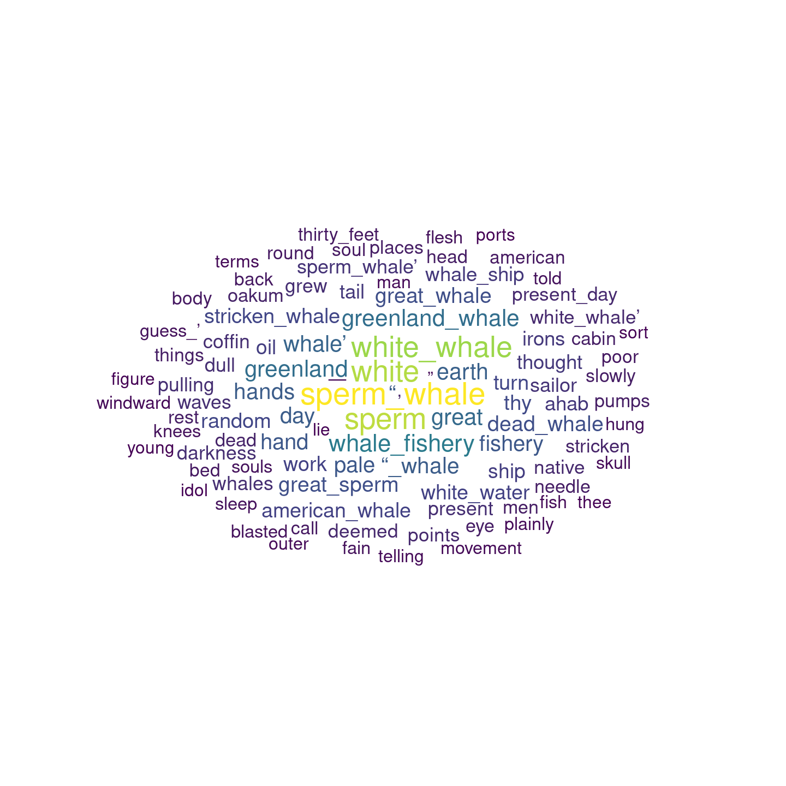

# Overview

Repository to make the _GloVe: Global Vectors for Word Representation_ model implemented by `text2vex` more accessible.

# Installation


```r
devtools::install_github("HanjoStudy/easyGlove")
library(easyGlove)
```

# Example

## Libraries


```r
library(tidyverse)
library(easyGlove)
```


## Data


```r
out <- read_lines("https://www.gutenberg.org/files/2701/2701-0.txt")
```


## Run Model


```r
set.seed(1)
word_vectors <- model_glove(out, ngrams = 2,
                   term_count_min = 5,
                   skip_grams_window = 10L,
                   runs = 10,
                   cores = 14)
```

```
## INFO  [08:03:43.759] epoch 1, loss 0.1247 
## INFO  [08:03:43.846] epoch 2, loss 0.0636 
## INFO  [08:03:43.914] epoch 3, loss 0.0483 
## INFO  [08:03:43.973] epoch 4, loss 0.0389 
## INFO  [08:03:44.033] epoch 5, loss 0.0321 
## INFO  [08:03:44.095] epoch 6, loss 0.0269 
## INFO  [08:03:44.155] epoch 7, loss 0.0230 
## INFO  [08:03:44.215] epoch 8, loss 0.0200 
## INFO  [08:03:44.275] epoch 9, loss 0.0176 
## INFO  [08:03:44.335] epoch 10, loss 0.0158
```

## Closest Word Vectors


```r
word_sim <- word_vectors %>% 
  glove_closest_to(., "whale", top_n = 100)

head(word_sim)
```

```
##   sperm_whale         sperm         white   white_whale               
##     0.8410145     0.7782144     0.7689985     0.7476351     0.5652152 
## whale_fishery 
##     0.5014852
```

## Plotting results


```r
plot_glove(word_sim)
```

<!-- -->

## Calculations


```r
(word_vec(word_vectors, "captain") + word_vec(word_vectors, "whale")) %>%
  closest_to(., word_vectors = word_vectors, top_n = 20)
```

```
##         whale       captain          ahab                       sperm 
##     0.7911933     0.7407873     0.6373060     0.6350041     0.6331298 
##   sperm_whale             “         white  captain_ahab   white_whale 
##     0.6309449     0.5852657     0.5851215     0.5408898     0.4732944 
##       “_whale        holder         peleg         hands     greenland 
##     0.4011279     0.3989700     0.3973496     0.3854662     0.3845059 
##           day             ’    altogether          head circumstances 
##     0.3835829     0.3806373     0.3760317     0.3727943     0.3702037
```


