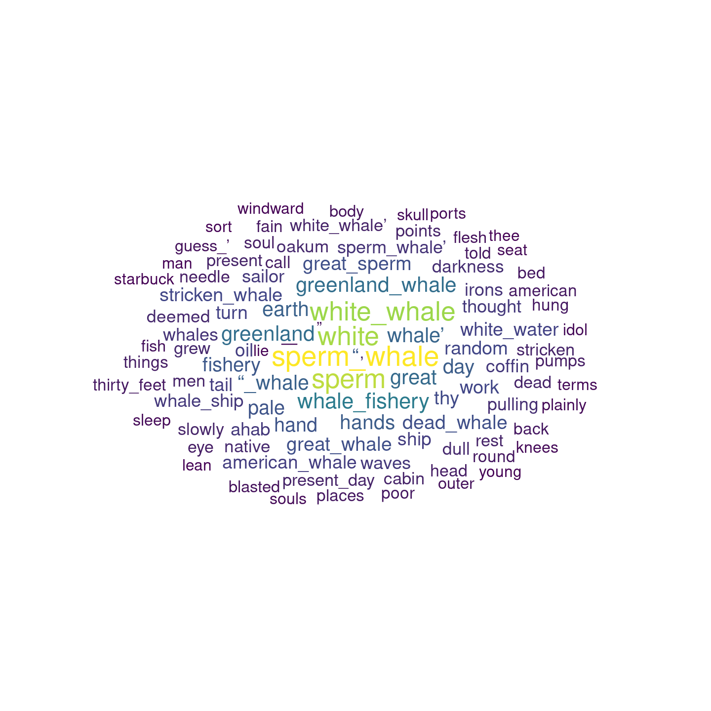

easyGlove
================
Hanjo Odendaal
11/04/2022

# Overview

Repository to make the *GloVe: Global Vectors for Word Representation*
model implemented by `text2vex` more accessible.

# Installation

``` r
devtools::install_github("HanjoStudy/easyGlove")
library(easyGlove)
```

# Example

## Libraries

``` r
library(tidyverse)
library(easyGlove)
```

## Data

``` r
out <- read_lines("https://www.gutenberg.org/files/2701/2701-0.txt")
```

## Run Model

``` r
set.seed(1)
word_vectors <- model_glove(out, ngrams = 2,
                   term_count_min = 5,
                   skip_grams_window = 10L,
                   runs = 10,
                   cores = 14)
```

    ## INFO  [08:06:04.727] epoch 1, loss 0.1246 
    ## INFO  [08:06:04.817] epoch 2, loss 0.0636 
    ## INFO  [08:06:04.886] epoch 3, loss 0.0483 
    ## INFO  [08:06:04.948] epoch 4, loss 0.0389 
    ## INFO  [08:06:05.007] epoch 5, loss 0.0321 
    ## INFO  [08:06:05.070] epoch 6, loss 0.0269 
    ## INFO  [08:06:05.131] epoch 7, loss 0.0230 
    ## INFO  [08:06:05.194] epoch 8, loss 0.0200 
    ## INFO  [08:06:05.256] epoch 9, loss 0.0176 
    ## INFO  [08:06:05.317] epoch 10, loss 0.0158

## Closest Word Vectors

``` r
word_sim <- word_vectors %>% 
  glove_closest_to(., "whale", top_n = 100)

head(word_sim)
```

    ##   sperm_whale         sperm         white   white_whale               
    ##     0.8421034     0.7769406     0.7648248     0.7476010     0.5723478 
    ## whale_fishery 
    ##     0.5038683

## Plotting results

``` r
plot_glove(word_sim)
```

<!-- -->

## Calculations

``` r
(word_vec(word_vectors, "captain") + word_vec(word_vectors, "whale")) %>%
  closest_to(., word_vectors = word_vectors, top_n = 20)
```

    ##        whale      captain         ahab                     sperm  sperm_whale 
    ##    0.7953682    0.7444666    0.6353951    0.6346500    0.6309731    0.6251410 
    ##            “        white captain_ahab  white_whale      “_whale       holder 
    ##    0.5843338    0.5766175    0.5405346    0.4751232    0.4147661    0.4000407 
    ##        peleg    greenland         ship            ’        hands   altogether 
    ##    0.3941382    0.3895074    0.3877947    0.3864150    0.3847839    0.3792533 
    ##          day         fish 
    ##    0.3785703    0.3738557
